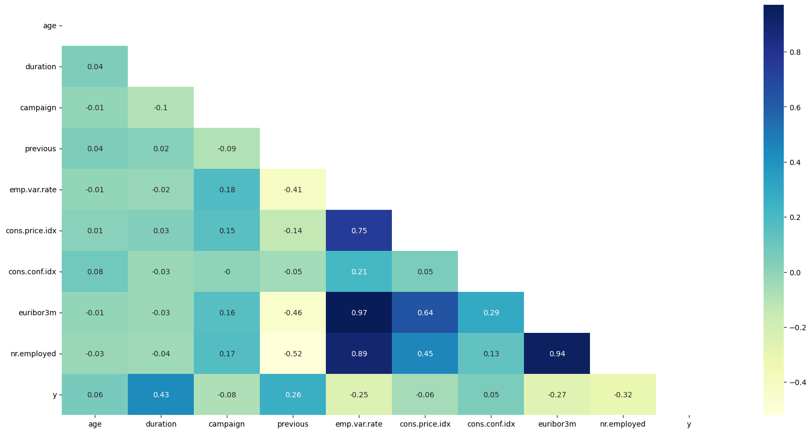
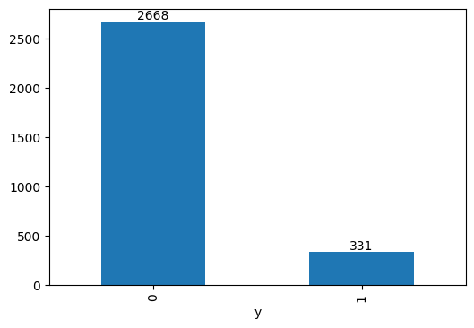

# Bank Marketing Automation (Capstone 1 ML Zoomcamp)

## Problem Statement

The data is related with direct marketing campaigns of a Portuguese banking institution. The marketing campaigns were based on phone calls. Often, more than one contact to the same client was required, in order to access if the product (bank term deposit) would be ('yes') or not ('no') subscribed ([Kaggle](https://www.kaggle.com/competitions/marketing-data/overview))

### Data Dictionary

|Field          | Description                               | Group     |
|---------------|-------------------------------------------|-----------|
|age            |age                                        | Features  |
|job	        |job                                        | Features  |
|marital        |marital status                             | Features  |
|education      |education group                            | Features  |
|default        |has credit default?                        | Features  |
|housing        |has housing loan?                          | Features  |
|loan           |has personal loan?                         | Features  |
|contact        |contact communication type('cellular','telephone') | Features  |
|month          |last contact month of year                 | Features  |
|day_of_week    |last contact day of the week               | Features  |
|duration       |last contact duration, in seconds          | Features  |
|campaign       |number of contacts performed during this campaign and for this client | Features  |
|pdays          |number of days that passed by after the client was last contacted from a previous campaign (numeric; 999 means client was not previously contacted) | Features  |
|previous       |number of contacts performed before this campaign and for this client (numeric) | Features  |
|poutcome       |outcome of the previous marketing campaign (categorical: 'failure','nonexistent','success') | Features  |
|emp.var.rate   |employment variation rate - quarterly indicator (numeric) | Features  |
|cons.price.idx |consumer price index - monthly indicator (numeric) | Features  |
|cons.conf.idx  |consumer confidence index - monthly indicator (numeric) | Features  |
|euribor3m      |euribor 3 month rate - daily indicator (numeric) | Features  |
|nr.employed    |number of employees - quarterly indicator (numeric) | Features  |
|y              |has the client subscribed a term deposit? (binary: 'yes','no') | Label     |


## Environment Setup
1. Install Anaconda and create new conda environment (can refer to miniconda or anaconda documentation)
2. Conda install uv
3. Run uv sync with conda activated

For the script environment setup please refer to this with conda installed on your computer:
```bash
conda create -n bank-marketing-automation
conda activate bank-marketing-automation
conda install python=3.12
pip install uv
uv sync --locked
```


## Exploratory Data Analysis

### Data Distribution & Correlation

As correlation checking we identified that duration of call and previous has highly correlated to y

### Target Distribution
Data for this cases is highly imbalance dataset, with majority of the class is 0, means they do not subscribe to bank term deposit for whole dataset only 331 customers that subsribed (11.03%)



### Feature Selection
For feature selection implemented 2 kind of selection. For numeric feature we implement variance threshold, and field with low variance will be drop, while for categoric features we implement chi-square, and feature with less importance will be drop

1. Based on variance selection (threshold 0.9) we remove several features that are `previous, cons.price.idx`. With final numeric features are:
    - age
    - duration
    - campaign
    - emp.var.rate
    - cons.conf.idx
    - euribor3m
    - nr.employe


2. Based on chi-square feature selection we remove several features that are `loan, housing, month, and day_of_week`. With final categoric features are:
    - contact
    - education
    - default
    - poutcome
    - job
    - marital 

